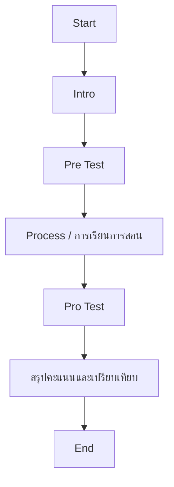
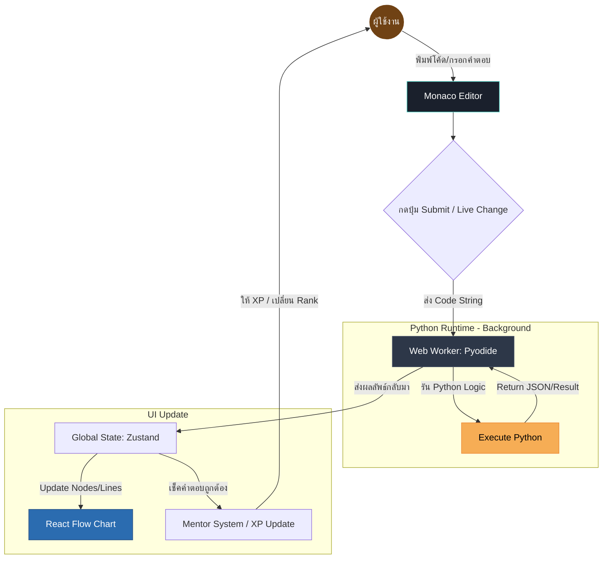

```mermaid
flowchart TB
	A["Start"]
	AA["Intro"]
	X["Pre Test"]
	B["Process / การเรียนการสอน"]
	Y["Pro Test"]
	C["สรุปคะแนนและเปรียบเทียบ"]
	D["End"]
	
	A --> AA
	AA-->X
	X --> B
	B --> Y
	Y --> C
	C --> D
```

---

```mermaid
graph TD
    %% Nodes Definition
    User((ผู้ใช้งาน))
    Editor[Monaco Editor]
    Action{กดปุ่ม Submit / Live Change}
    Worker[Web Worker: Pyodide]
    LogicState[Global State: Zustand]
    ReactFlow[React Flow Chart]
    Mentor[Mentor System / XP Update]

    %% Flow
    User -->|พิมพ์โค้ด/กรอกคำตอบ| Editor
    Editor --> Action
    Action -->|ส่ง Code String| Worker
    
    subgraph Python_Runtime [Python Runtime - Background]
        Worker -->|รัน Python Logic| Exec[Execute Python]
        Exec -->|Return JSON/Result| Worker
    end

    Worker -->|ส่งผลลัพธ์กลับมา| LogicState
    
    subgraph UI_Update [UI Update]
        LogicState -->|Update Nodes/Lines| ReactFlow
        LogicState -->|เช็คคำตอบถูกต้อง| Mentor
    end

    Mentor -->|ให้ XP / เปลี่ยน Rank| User
    
    %% Styling for Obsidian Dark Mode
    style Worker fill:#2d3748,stroke:#4a5568,color:#fff
    style Exec fill:#f6ad55,stroke:#ed8936,color:#000
    style ReactFlow fill:#2b6cb0,stroke:#2c5282,color:#fff
    style Editor fill:#1a202c,stroke:#4fd1c5,color:#fff
    style User fill:#704214,stroke:#fff,color:#fff
```
